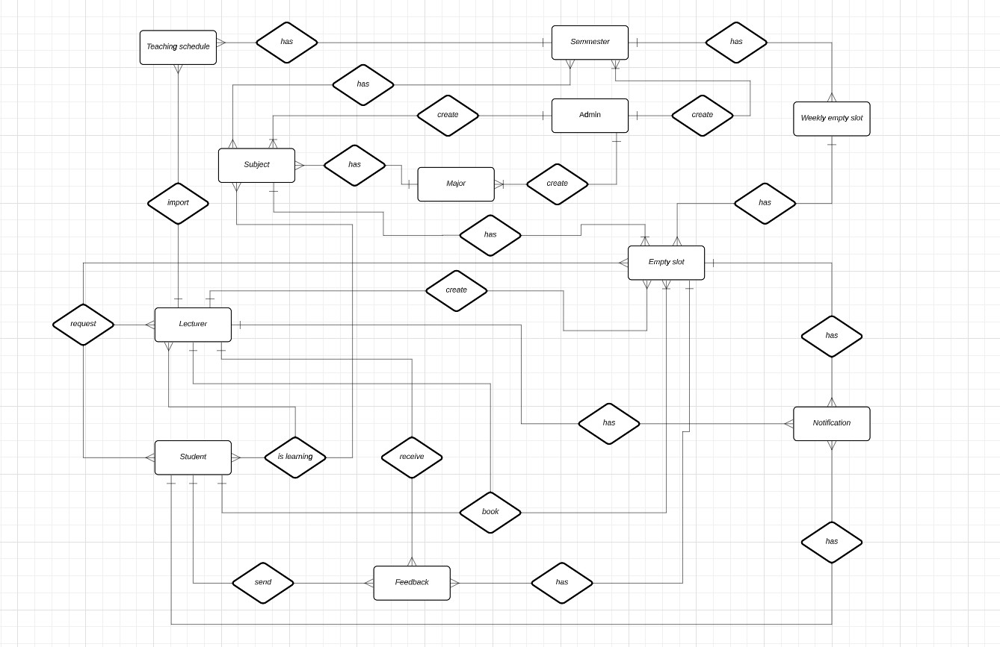

<a name="readme-top"></a>

<!-- PROJECT LOGO -->
<br />
<div align="center">
  <a href="https://github.com/Mhiudangniengrang/FPT_LOGIN">
    
  </a>
</div>


<!-- ABOUT THE PROJECT -->
## About The Project
1. Usecase Diagram:

    
2. ERD diagram:
   
    
3. Database diagram:
   
   

## Getting Started

This is an example of how you may give instructions on setting up your project locally.
To get a local copy up and running follow these simple example steps.

### Prerequisites

This is an example of how to list things you need to use the software and how to install them.
* npm
  ```sh
  npm install npm@latest -g
  ```

### Installation

_Below is an example of how you can instruct your audience on installing and setting up your app. This template doesn't rely on any external dependencies or services._

1. Clone the repo
   ```sh
   git clone https://github.com/your_username_/Project-Name.git
   ```
2. Install NPM packages
   ```sh
   npm install --legacy-peer-deps
   ```

<p align="right">(<a href="#readme-top">back to top</a>)</p>


<!-- USAGE EXAMPLES -->
## Usage

1. Front-end: [https://github.com/Mhiudangniengrang/MEET-MY-LECTURE.git](https://github.com/Mhiudangniengrang/MEET-MY-LECTURE.git)

2. Back-end: [https://github.com/truonghuy2490/Meet_My_Lecture.git](https://github.com/truonghuy2490/Meet_My_Lecture.git)
